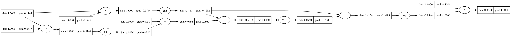

# Lecture 1: Building micrograd

Lecture 1 builds intuition for gradients and backpropagation with micrograd, a backpropagation engine for scalars. 

## Exercises

`micrograd_exercises.ipynb` was provided

## Application

I added a handful of methods to micrograd so that I could build the smallest softmax-activated "neural network" I could think of. It takes a constant scalar input and adjusts its two weights to 
minimize the negative log likelihood of the data (a constant vector [0, 1]) under the model. Run with `python main.py`. Graphviz visualization below.

