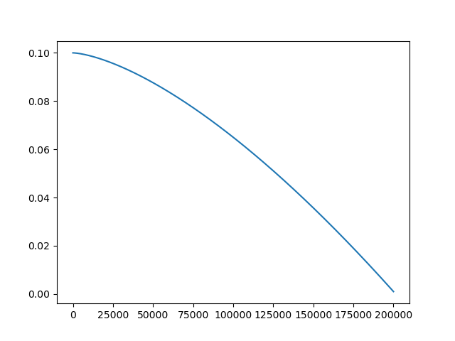
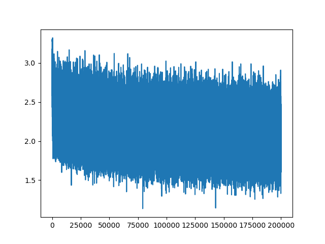
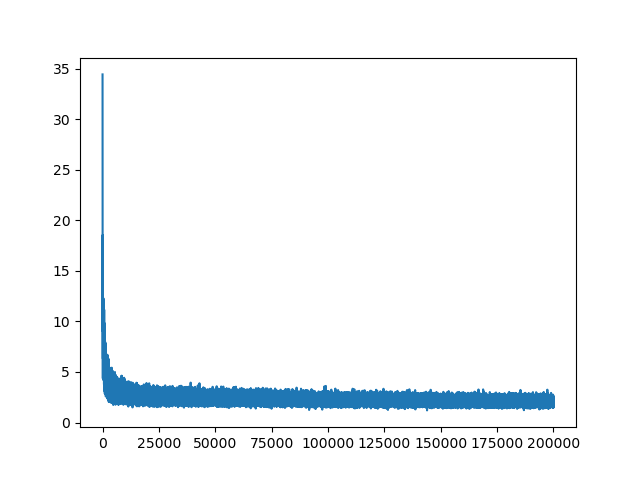

# Lecture 3

Andrej introduces an MLP as a simple character-level language model in lecture 3, based on [A Neural Probabilistic Language Model](https://www.jmlr.org/papers/volume3/bengio03a/bengio03a.pdf)

## Exercises:

### "E01: Tune the hyperparameters of the training to beat my best validation loss of 2.2"

Default hyperparameters (without scaling params at initialization) train to validation loss of ~2.13. The most significant difference is the annealed learning rate (see below).

### "E02: I was not careful with the intialization of the network in this video. (1) What is the loss you'd get if the predicted probabilities at initialization were perfectly uniform? What loss do we achieve? (2) Can you tune the initialization to get a starting loss that is much more similar to (1)?"

1) We would expect loss = nll = -log(1/num_classes) = -log(1/27) = ~3.3 in the case of uniform predicted probabilities. Upon zeroing the weights and biases that generate the logits (resulting in
zero-valued logits and uniform probabilities), we obtain a loss of ~3.2, which agrees with the prediction. 

2) Scaling all model parameters by a factor of 0.1 at initialization results in probabilities close to uniform and an initial loss of ~3.3. This initiailzation scheme also 
decreases validation loss to ~2.09. Smaller weights offer improved gradient flow through the hidden layer's tanh() activation function and save the model from having to learn to decrease extreme
logit values. Shown below are loss curves for normally distributed parameter initialization and the scaled version, illustrating that decreasing the initial parameter values decreases the initial loss
and helps training.

### "E03: Read the Bengio et al 2003 paper (link above), implement and try any idea from the paper. Did it work?"

Direct connections between the character embeddings and the output logits are supported and a model can be trained with them by adding the `--direct_connections` flag. I found their impact on
performance to be negligible. The authors included these connections optionally; they could not determine if they were useful or not, but noticed better generalization on smaller datasets when omitting
the direct connections. 
